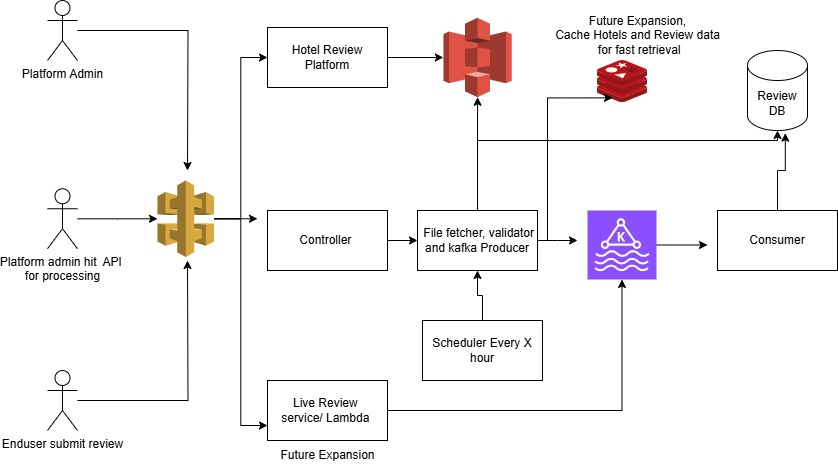

# Review System Microservice

This microservice retrieves hotel reviews from third-party providers (Agoda, Booking.com, Expedia) from an AWS S3 bucket, processes the data, and stores it in a relational database.

## Architecture

The application follows Clean Architecture principles with the following layers:

1. **Domain Layer**: Core business entities and repository interfaces
2. **Application Layer**: Services that implement business logic
3. **Infrastructure Layer**: External service implementations, database access, kafka 
4. **Presentation Layer**: REST controllers and scheduled jobs

 **Architecture Diagram**
 

## Features

- Connects to AWS S3 to retrieve review files in JSONL format
- Processes reviews, handling validation and data transformation
- Push each review in Kafka
- Stores processed reviews in a PostgreSQL database
- Supports idempotent processing with tracking of processed files
- Provides both scheduled processing and manual triggers via REST API
- Robust error handling and logging
- Dockerized setup for easy deployment

## Technology Stack

- Java 17
- Spring Boot 3.x
- PostgreSQL (database)
- AWS SDK for S3 integration
- Kafka (event Processing)
- Zookeeper (for Kafka)
- Maven (build tool)
- Docker & Docker Compose
- JUnit 5 & Mockito (testing)

## Getting Started

### Prerequisites

- Docker and Docker Compose
- Java 17 (for local development)
- Maven (for local development)

### Running with Docker Compose

1. Clone the repository
2. Start the application and dependencies:

```bash
docker-compose up -d
```

This will start:
- PostgreSQL database
- LocalStack (S3 emulator)
- Kafka and Zookeeper
- nginx (for load balancing)
- The Review Service application

3. The service will automatically start processing sample review files from the emulated S3 bucket.

4. Once the services are up, please follow below steps
   - Create a bucket in LocalStack S3: aws --endpoint-url=http://localhost:4566 s3 mb s3://review-data-bucket
   - Upload sample review files to the bucket: aws --endpoint-url=http://localhost:4566 s3 cp /path/to/sample/review.jsonl s3://review-data-bucket/reviews/

```bash
### Running Locally

1. Clone the repository
2. Build the application:

```bash
mvn clean package
```

3. Run the application (It will not help as it needs configuration for AWS, Kafka and DB):

```bash
java -jar target/review-service-1.0.0.jar
```

Note: When running locally, you'll need to configure database and AWS settings in `application.yml` or via environment variables.

## Configuration

Configuration can be provided via environment variables or updated in `application.yml`:

| Environment Variable | Description                              | Default Value                             |
|----------------------|------------------------------------------|-------------------------------------------|
| DATASOURCE_URL | JDBC URL for database                    | jdbc:postgresql://localhost:5432/reviewdb |
| DATASOURCE_USERNAME | Database username                        | postgres                                  |
| DATASOURCE_PASSWORD | Database password                        | postgres                                  |
| AWS_REGION | AWS region                               | us-east-1                                 |
| AWS_S3_BUCKET | S3 bucket name                           | review-data-bucket                        |
| AWS_S3_PREFIX | S3 key prefix for reviews                | reviews/                                  |
| AWS_ACCESS_KEY | AWS access key                           |                                           |
| AWS_SECRET_KEY | AWS secret key                           |                                           |
| AWS_ENDPOINT_OVERRIDE | S3 endpoint override (for local testing) | localstack is used here for testing       |
| REVIEW_PROCESSING_CRON | Cron expression for scheduled processing | 0 0 * * * * (hourly)                      |
| SPRING_KAFKA_BOOTSTRAP_SERVERS | Kafka end point                          | kafka:9092                     |


## To run application with BLUE GREEN deployment.
  - (Windows, where I made the project)To switch traffic, comment/uncomment the server line in nginx.conf, and reload or restart the nginx container.
  - (Linux platform)To reload the nginx configuration without downtime, run:
    chmod +x deploy.sh
    ./deploy.sh green   # deploy green, stop blue, update Nginx
    ./deploy.sh blue    # deploy blue, stop green, update Nginx

docker-compose restart nginx

## API Endpoints

- `POST /api/v1/reviews/process`: Trigger manual processing of new review files
- `GET /api/v1/reviews/hotel/{hotelId}`: Get the reviews of the hotel by Hotel ID
## Database Schema

The database schema includes the following tables:

- `review_providers`: Stores information about review providers (Agoda, Booking.com, Expedia)
- `hotels`: Stores hotel information
- `reviews`: Stores the actual review data
- `review_responses`: Stores hotel responses to reviews
- `processed_files`: Tracks processed files to prevent reprocessing

## Design Decisions

1. **Clean Architecture**: The application follows clean architecture principles to ensure separation of concerns and maintainability.

2. **Idempotent Processing**: Files are tracked in the database to prevent reprocessing the same file multiple times.

3. **Concurrent Processing**: Multiple files can be processed concurrently using Spring's/ Java async capabilities.

4. **Event Driven Processing**: Every event is processed asynchronously and solution can be scaled easily.

5. **Error Handling**: Robust error handling ensures that failures in processing one file or record don't affect others.

6. **Configuration Driven**: Most aspects of the application can be configured through environment variables.

## Assumptions

1. Review files are in JSONL format with well-formed JSON objects.
2. S3 bucket structure follows the expected pattern with reviews stored under a specific prefix.
3. Each review has a unique provider-specific ID.
4. Provider names are consistent and match the data in the database.

## Testing

The project includes unit tests for core components and has coverage more than 80%. To run the tests:

```bash
mvn test
```
## Future Expansion 
1. Dead Letter queue in consumer for failed reviews reporting.
2. Direct consumption of reviews from providers through the kafka/Lambda.
3. Have caching mechanism for hotels/reviews so that new reviews can be processed easily.
